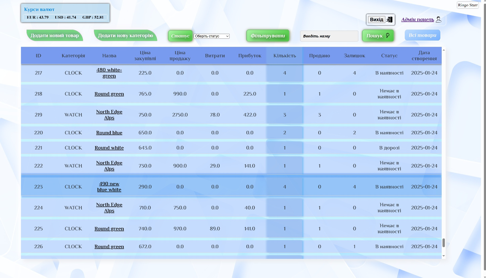
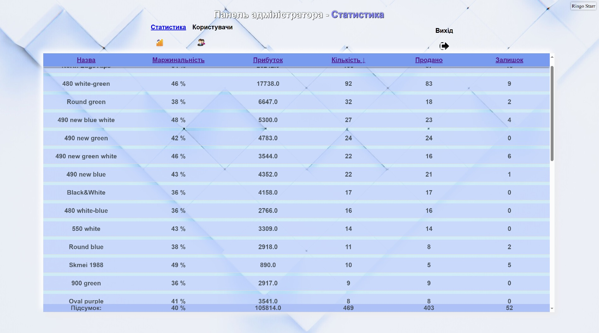

# StorageBox

**StorageBox** — це веб-додаток для складського обліку товарів, який дозволяє ефективно керувати запасами, відстежувати статуси товарів та управляти користувачами.

## Огляд

StorageBox розроблений для забезпечення зручного та інтуїтивного управління товарами на складі. Додаток має два основні інтерфейси:
- **Інтерфейс менеджера:** простий HTML/CSS дизайн.
- **Адмін-панель:** інтерфейс для адміністраторів, що містить статистику по товарам та можливості керування користувачами (зміна ролей, видалення).

Нижче наведені деякі приклади інтерфейсу додатку:

### Головна сторінка

### Адмін-панель

## Функціональні можливості

- **Облік товарів:**  
  Кожен товар має статуси:
    - **В дорозі:** товар знаходиться в процесі доставки.
    - **В наявності:** товар є на складі.
    - **Немає в наявності:** товар відсутній.

- **Інтеграції:**
    - **Amazon S3:** використовується для збереження фотографій товарів.
    - **Currency Exchange API:** забезпечує отримання актуальних курсів валют для зручного розрахунку вартості.

- **Контейнеризація:**  
  Docker забезпечує простоту розгортання та консистентність середовища.

- **Хостинг:**  
  Додаток розміщений на [Render](https://storagebox-qgxc.onrender.com/).  
  **Примітка:** Оскільки зараз використовується безкоштовний сервіс, додаток після бездіяльності "засинає" на 2-3 хвилини, що може спричиняє до затримок при першому запиті.

## Використані технології

- **Backend:**
    - [Spring Boot](https://spring.io/projects/spring-boot) — основа для розробки RESTful сервісів.
    - [Spring Security](https://spring.io/projects/spring-security) — забезпечення аутентифікації та авторизації, включаючи можливості для адміністраторів.

- **Frontend:**
    - HTML та CSS — розробка зручного та адаптивного інтерфейсу.

- **Хмарні сервіси:**
    - Amazon S3 — зберігання фотографій товарів.
    - Currency Exchange API — отримання актуальних курсів валют.

- **Контейнеризація:**
    - Docker — створення образу та розгортання додатку.

## Як розпочати

### Передумови

- **Docker:** встановлений на вашій машині.
- **Java:** якщо ви плануєте запускати додаток без Docker.
- Наявність облікових даних для Amazon S3.
- Ваша база данних (PostgreSQL) 
- в application.yml імпортується application-secret.yml з паролями і ключами (налаштувати свої)

1. **Клонування репозиторію:**

   git clone https://github.com/Goldstain/StorageBox.git

